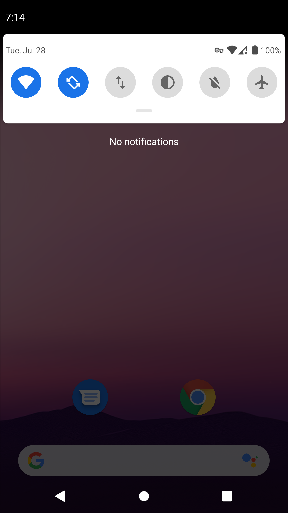
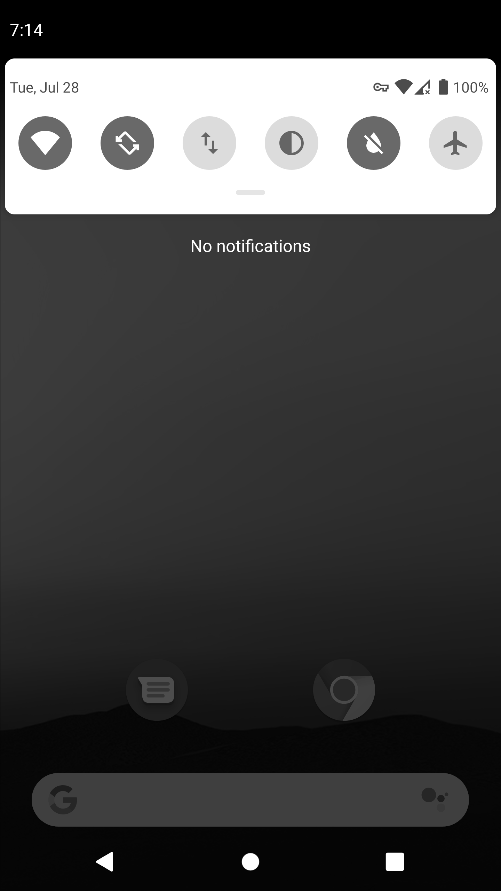

# Greyscale

Greyscale is a quick settings tile for Android which allows you to toggle a
device between colour display and greyscale.


## Screenshots





## How to use

In order to use Greyscale, you must manually grant it the
[`WRITE_SECURE_SETTINGS`](https://developer.android.com/reference/android/Manifest.permission#WRITE_SECURE_SETTINGS)
permission, since this permission is not normally available to third party
apps.

This can be done through adb by running the following from the command line:

```
adb shell pm grant io.github.rsookram.greyscale android.permission.WRITE_SECURE_SETTINGS
```

If you later wanted to remove the permission, you can run:

```
adb shell pm revoke io.github.rsookram.greyscale android.permission.WRITE_SECURE_SETTINGS
```

Once this is done,
[adding the quick settings tile](https://support.google.com/android/answer/9083864)
is all that's left to do before you can use it.


## Why use it?

This same option exists under `Developer Options > Simulate color space`, but
it's convenient to have a quick settings tile if you want to change it
frequently.

Also of note is that the APK is < 20 KB in size, and there are no third party
dependencies used in the app.


## Forked!

This was forked from
[BerenLuth/Greyscale](https://github.com/BerenLuth/Greyscale) which in turn
was forked from [fei-ke/Greyscale](https://github.com/fei-ke/Greyscale). Almost
all of the code has been changed since being forked however.
